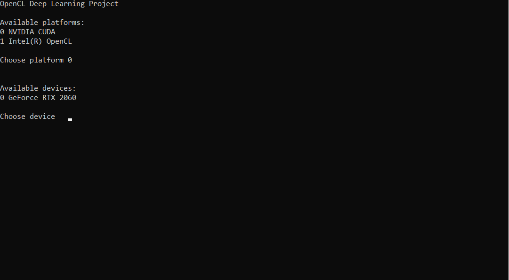
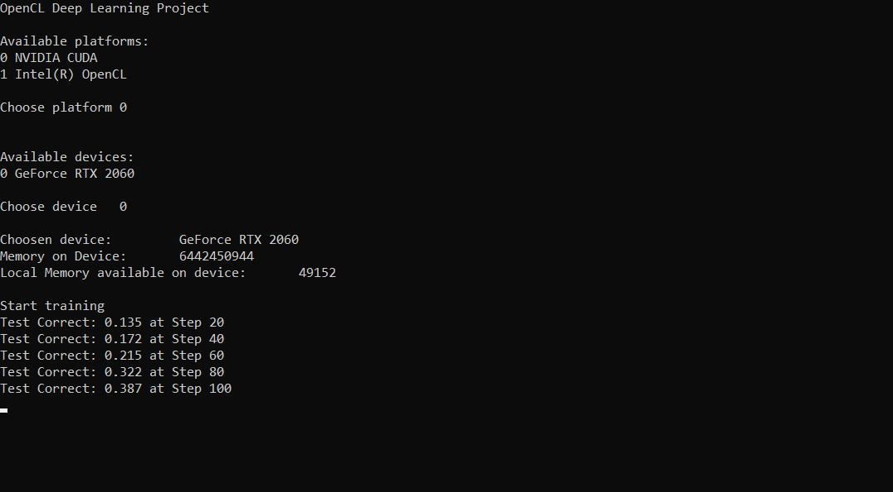
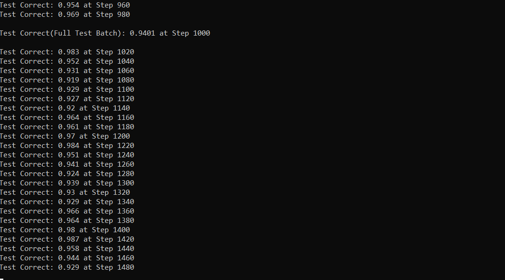

# DeepCL
Educational Deep Learning framework based on C++ and OpenCL.  

This is a Deep Learning framework I wrote during my Master thesis. It allows the creation of Various Convolutional Neural Network Architectures as well as normal Feed Forward Neural Networks.  

##	Explanation
To support various Neural Network architectures the framework makes use of a static computation graph, that can then be executed on the GPU or CPU.
The static computation graph is used for automatic differentation, allowing differentation through arbitrary mathematical expressions implemented in this framework. But it is built in a way that allows an easy extension with new Operations.
Besides the OpenCL kernel it consists of 3 different Modules:  
*	Backend System
*	Data System
*	NN System  

### Backend System
The Backend System encapsulates all accesses to OpenCL and loads all Kernel files. The name of that the system should load must be written into the KernelConfig.txt file. They are assumed to have .cl as file ending. 	The BackendSystem also contains an object for storing operation data and calling the respective OpenCL Kernel. It makes heavy use of template meta programming and variadic templates.

### Data System
The Data System contains all functionality related to Data loading. By implementing the BaseDataLoader interface multi-threaded data loading is made possible. It contains a class for reading idx like they are used for the MNIST dataset and functions for performing basic data transformation/pre-processing. It can be used to create data batches very efficiently.  

### NN System
The NN System provides the interface with which the creation, execution and training can be done. It initializes OpenCL and allows the executing and construction of various Neural Network architectures by building a static Computation Graph. The graph supports automatic differentiation by performing Backpropagation. The training of multiple Neural Network architectures without the need to compute the gradients manually is hereby possible.    
When a user creates an operation or buffer object no pointer is ever returned. It only returns an ID of the operation which can then be used further when building the graph. This way the user doesn’t has to handle clean up of the data and the library is overall safer.  
Further information can be found in my master’s thesis. It can be found inside the docs folder.  

##	Example
The bin directory contains an executable (compiled for windows x86) that trains the LeNet model, using the CPU or GPU, on the MNIST dataset.  
The source code of it can be found in the main file.  
In the following images an execution on the MNIST dataset is displayed.  
  
  

In order to run the example, download the .exe file as well as the Kernel folder. The example requires all four files of the MNIST dataset to be available:  
* train-images-idx3-ubyte.gz  
* train-labels-idx1-ubyte.gz  
* t10k-images-idx3-ubyte.gz  
* t10k -labels-idx1-ubyte.gz  

The files are available at  
http://yann.lecun.com/exdb/mnist/  
The executable, the Kernel folder and the dataset files must be placed in the same directory before the execution of the program.  

##	Usage
In order to use the library, the DLL file must be included into a project and the Kernel file must be added to the directory of the executable. An example on how the library can be used can be found in the main file contained in src/cpp source directory.

##	Requirements
*	Min OpenCL 2.1
*	C++ 11  

Currently, it was only built and tested with Visual Studio 2015.  

##	Building
In order to build the project, add all files in src/cpp to a Project and include the OpenCL.lib and its header files to the project. They are provided by the AMD and NVIDIA depending on the used GPU. NVIDIA provides them together with CUDA toolkit.  
